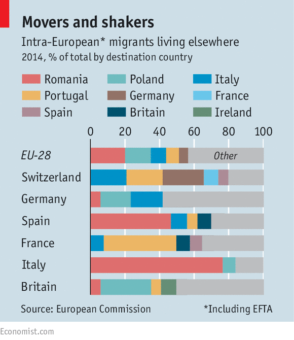

## Data source

 * [Population on 1 January by five year age group, sex and citizenship](http://appsso.eurostat.ec.europa.eu/nui/show.do?dataset=migr_pop1ctz&lang=en)
 * [Immigration by five year age group, sex and country of birth](http://appsso.eurostat.ec.europa.eu/nui/show.do?dataset=migr_imm3ctb&lang=en) This dataset seems less complete
 * OECD has similar data, less recent but more complete for some countries (France, ...) [OECD international migration DB](https://stats.oecd.org/Index.aspx?DataSetCode=MIG#)



_(in_absolute_numbers_and_as_a_percentage_of_the_total_foreign_foreign-born_population)_YB16.png)


```{r setup, include=FALSE}
downloadData <- F

eu.pop.data.file <- "data/eurostat_pop_all.csv"
outfile <- "input/data_pop_2015.csv"

# Eurostat data tables
es.tb <- c('migr_pop1ctz')

library(readr)
library(tidyr)
library(dplyr)
library(magrittr)
library(countrycode)
library(ggplot2)
library(scales)
library(swiMap)
library(swiTheme)
library(forcats)

### Getting data in packages
library(eurostat)
### Misc stuff
require(forcats)
```


### Get/load data

```{r load data, include = F}
### Get data from Eurostat
if(downloadData) {
  
  #Get population data 
  dat <- get_eurostat(es.tb, time_format = "raw", cache = F, keepFlags = T)
  
  # wrange & discard 
  data <- label_eurostat(dat %>% select(-flags), eu_order = T, code = c("citizen", "geo"))
  data$time <- as.numeric(data$time)
  # # add back data flags ??
  # data$flags <- dat$flags
  data %<>% 
    select (-unit) %>% filter(age == "Total", sex == "Total") %>%
    select (-age, -sex)
  write.csv(data, eu.pop.data.file, row.names = F)
} else {
  data <- read.csv(eu.pop.data.file)
}

```

## Some key numbers

```{r some stats, results="asis", echo = F}
eu.ct <- c(eu_countries[,1], efta_countries[,1])
dd <- data %>% filter(geo_code %in% eu.ct) %>% filter(time == 2015)


cat("\n### EU28")
eu.toteu <- dd %>% filter(geo_code %in% eu_countries[,1], citizen_code == 'EU28_FOR') %>%
  select(values) %>% unlist(use.names = F) %>% sum()
cat("\n* ", "Total number of EU28 foreigners in EU28 countries:", eu.toteu)
eu.tot <- dd %>% filter(geo_code %in% eu_countries[,1], citizen_code == 'FOR') %>%
  select(values) %>% unlist(use.names = F) %>% sum()
cat("\n* ", "Total number of foreigners in EU28 countries:", eu.tot)
cat("\n* ", "Total number of non-EU28 foreigners in EU28 countries:", eu.tot - eu.toteu)
cat("\n* ", "Share of EU28 foreigners in EU countries:", (eu.toteu /eu.tot) * 100)

cat("\n\n### EU28 + EFTA foreigners")
euefta.tot <- dd %>% filter(citizen_code %in% c('EU28_FOR', 'EFTA_FOR')) %>%
  select(values) %>% unlist(use.names = F) %>% sum()
cat("\n* ", "Total number of EU28 + EFTA foreigners in EU28 + EFTA countries:", euefta.tot)
for.tot <- dd %>% filter(citizen_code == "FOR") %>%
  select(values) %>% unlist(use.names = F) %>% sum()
cat("\n* ", "Number of non-EU28/EFTA foreigners in EU28 + EFTA countries:", for.tot - euefta.tot)
cat("\n* ", "Total number foreigners in EU28 + EFTA countries:", for.tot)
cat("\n* ", "Share of EU28 + EFTA foreigners in EU28 + EFTA countries:", (euefta.tot /for.tot) * 100)

cat("\n\n###Total Population in EU28 + EFTA")
euefta.totpop <- dd %>% filter(citizen_code == "TOTAL") %>% select(values) %>% sum()
cat("\n*", euefta.totpop)
cat("\n* Proportion foreigners", (for.tot / euefta.totpop) * 100)
cat("\n* Proportion of EFTA/EU28-foreigners", (euefta.tot / euefta.totpop) * 100, "\n\n")
```
## Wrangle data for waffle chart

### remove useless aggregate citizenship

```{r wrangle to get the latest year and dicard most aggregates}
agg.idx <- which(nchar(levels(data$citizen_code)) > 2)

#data[match(levels(data$citizen_code)[agg.idx], data$citizen_code),c("citizen", "citizen_code")]
agg.iso2 <- levels(data$citizen_code)[agg.idx]
iso2.keep <- c("NAT", "FOR", "EFTA_FOR", "EU28_FOR", "TOTAL")
agg.iso2 <- agg.iso2[!agg.iso2 %in% iso2.keep]


# Place aggregates as new columns
data %<>% filter(time == 2015) %>% select(-time)

data %<>%
  group_by(geo_code, geo) %>% 
  mutate(
    TOTAL = sum(values[citizen_code == "TOTAL"], na.rm = T),
    NAT = sum(values[citizen_code == "NAT"], na.rm = T),
    FOR = sum(values[citizen_code == "FOR"], na.rm = T),
    EFTA_FOR = sum(values[citizen_code == "EFTA_FOR"], na.rm = T),
    EU28_FOR = sum(values[citizen_code == "EU28_FOR"], na.rm = T)
  ) %>% ungroup() %>% filter(!citizen_code %in% levels(data$citizen_code)[agg.idx])


# remove the national values for each country and ensure NAT is equal to it!!
data <- do.call(rbind, by(data, data$geo_code, function(dd) {
  geoiso <- as.character(dd$geo_code[1])
  #cat("\n", geoiso)
  cit.value <- unlist(dd[which(dd$citizen_code == geoiso), 'values'])
  if(length(cit.value) > 0) {
    if(cit.value != dd$NAT[1]) {
    warning("\n", geoiso, "\t citizen:", cit.value, "\t NAT: ", dd$NAT[1])
    }    
  }
  dd[dd$citizen_code != geoiso,]
}))

write_csv(data, path = outfile)
```

```{r some more key stats}
ori <- data %>% group_by(citizen_code, citizen) %>%
  filter(geo_code %in%  c(eu_countries[,1], efta_countries[,1])) %>% 
  summarise(tot = sum(values)) %>% ungroup() %>% arrange(desc(tot))

ori$share_eueftaFor <- (ori$tot / euefta.tot) * 100
ori$share_totFor <- (ori$tot / for.tot) * 100
knitr::kable(head(ori, 10), digits = 2)

```